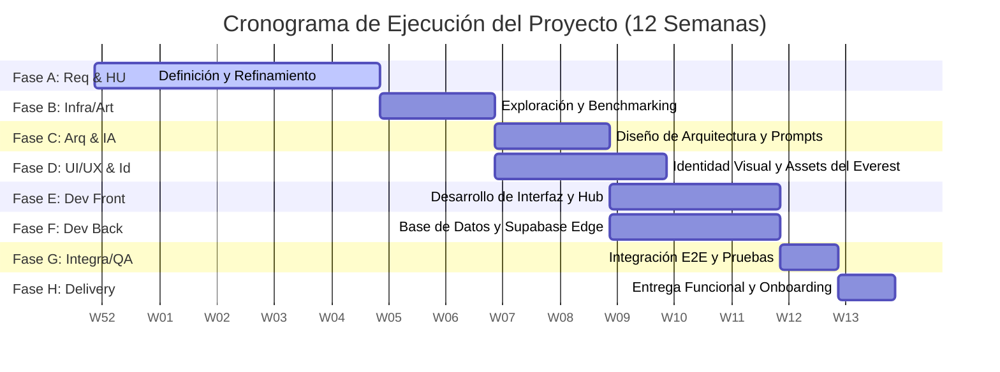

# 1. Plan Detallado del Proyecto: Cronograma y Ruta de Ejecución (Gantt-in-Markdown)

Este documento define la estructura temporal, las fases y la modalidad de trabajo (sincrónica/asíncrona) para el desarrollo de la plataforma de gamificación de analítica de talento humano y coaching corporativo. El plan abarca desde el levantamiento inicial hasta el delivery final, optimizado para ejecución bajo el paradigma de Desarrollo Guiado por Especificaciones (SDD).

**Duración total del proyecto: 12 semanas** (5 semanas dedicadas al levantamiento exhaustivo de historias de usuario + 7 semanas de diseño, desarrollo e integración).

## 📅 Estructura del Cronograma General (Horizonte: 12 Semanas | Sprint Base: 2 Semanas)

| ID | Fase / Actividad Principal | Duración | Modalidad | Entregables Clave | Dependencias |
| :--- | :--- | :---: | :---: | :--- | :--- |
| **A** | **Definición de Requerimientos e Historias de Usuario** | **W1 - W5** | Mixta | Backlog completo refinado en JSON/MD, Historias de Usuario con Criterios de Aceptación (Gherkin/Given-When-Then). | Ninguna |
| A1 | Workshop inicial de alineación del Everest Experience | W1 | Sincrónica | Acta de requerimientos funcionales y objetivos psicométricos. | - |
| A2 | Redacción exhaustiva de historias técnicas y de usuario (Admin, Coach, Org, Player) | W2-W5 | Asíncrona | Backlog oficial estructurado con tags de épicas y criterios de aceptación completos. | A1 |
| A3 | Refinamiento y estimación de Story Points del backlog completo | W5 | Mixta | Backlog priorizado y estimado listo para desarrollo. | A2 |
| **B** | **Exploración de Infraestructura y Estado del Arte** | **W5 - W6** | Asíncrona | Matriz de arquitectura técnica, Benchmark de gamificación. | A3 |
| B1 | Evaluación de capacidades y esquemas de Supabase (Auth, RLS, Storage) | Asíncrona | Modelo entidad-relación preliminar y políticas de seguridad. | A3 |
| B2 | Estado del arte: Evaluación de mecánicas de RPG aplicadas a psicometría | Asíncrona | Documento técnico de diseño de mecánicas y árboles de decisión. | A3 |
| **C** | **Diseño de Arquitectura de Plataforma** | **W6 - W7** | Mixta | Diagramas de componentes, Esquema de Base de Datos y API Contracts. | B1, B2 |
| C1 | Diseño del pipeline de datos analíticos para visualización de CEOs/Coaches | Asíncrona | Spec de tablas, triggers de Supabase y agregaciones. | B1 |
| C2 | Arquitectura del Agente Coach (Gemini API + Guardrails de Consulta) | Sincrónica | Definición del prompt del sistema, vectores y capas de control de privacidad. | B1 |
| **D** | **Identidad Corporativa y Piezas Visuales** | **W6 - W8** | Asíncrona | Brandbook, Assets del Everest, UI Kit básico. | A1 |
| D1 | Creación de logos, paleta cromática corporativa y tipografías | Asíncrona | Manual de marca en PDF y SVGs limpios para el Frontend. | A1 |
| D2 | Diseño del set de assets: Everest Paths, Avatares, Medallas y Sherpa NPC | Asíncrona | Spritesheets, ilustraciones de ítems e interfaz de la montaña. | D1 |
| **E** | **Diseño y Desarrollo de Frontend** | **W8 - W10** | Asíncrona | Aplicación SPA web responsiva (HTML5, JS, CSS/Tailwind). | C2, D2 |
| E1 | Implementación del Login, Hub Central y Gestión de Avatar/Inventario | Asíncrona | Módulos funcionales de cliente con autenticación acoplada. | C2 |
| E2 | Implementación de la experiencia Everest (Rutas, Modales de Retos, NPC) | Asíncrona | Motor de renderizado visual del mapa y lógicas de decisión. | D2, E1 |
| **F** | **Diseño y Desarrollo de Backend (Supabase Edge Functions / DB)** | **W8 - W10** | Asíncrona | Base de Datos funcional, Triggers y Capa de Guardrails del Agente. | C1, C2 |
| F1 | Despliegue del esquema en Supabase + Políticas RLS por rol de usuario | Asíncrona | Tablas optimizadas y seguras (Player, Coach, OrgAdmin, SysAdmin). | C1 |
| F2 | Integración del Agente de IA (Gemini API) con Guardrails psicométricos | Asíncrona | Edge Function de Supabase que expone el endpoint seguro de chat. | C2 |
| **G** | **Integración, Pruebas y Despliegue E2E** | **W11** | Mixta | Plataforma desplegada en entorno de staging/producción. | E2, F2 |
| G1 | Vinculación Frontend-Backend y validación de guardado de estado de ruta | Asíncrona | Pruebas de integración automatizadas y flujos críticos validados. | E2, F2 |
| G2 | Pruebas funcionales cruzadas (Aceptación de Usuario / QA de roles) | Sincrónica | QA Report con firmas de conformidad técnica de los ingenieros. | G1 |
| **H** | **Delivery al Área Funcional y Cierre** | **W12** | Sincrónica | Manuales, credenciales maestro, transferencia de conocimiento. | G2 |
| H1 | Entrega de credenciales, despliegue final en producción y entrenamiento | Sincrónica | Grabación del workshop de onboarding y entrega del repositorio limpio. | G2 |

---

## 📊 Representación Visual de Línea de Tiempo (Diagrama de Gantt)

```
Semanas:          | W1 | W2 | W3 | W4 | W5 | W6 | W7 | W8 | W9 | W10| W11| W12|
------------------------------------------------------------------------------------
Fase A: Req & HU  |XXXX|XXXX|XXXX|XXXX|XXXX|    |    |    |    |    |    |    |
Fase B: Infra/Art |    |    |    |    |XXXX|XXXX|    |    |    |    |    |    |
Fase C: Arq & IA  |    |    |    |    |    |XXXX|XXXX|    |    |    |    |    |
Fase D: UI/UX & Id|    |    |    |    |    |XXXX|XXXX|XXXX|    |    |    |    |
Fase E: Dev Front |    |    |    |    |    |    |    |XXXX|XXXX|XXXX|    |    |
Fase F: Dev Back  |    |    |    |    |    |    |    |XXXX|XXXX|XXXX|    |    |
Fase G: Integra/QA|    |    |    |    |    |    |    |    |    |    |XXXX|    |
Fase H: Delivery  |    |    |    |    |    |    |    |    |    |    |    |XXXX|
```



## 🎯 Criterios de Transición entre Fases (Milestones)
1. **M1 (Fin de Semana 5):** Backlog completo firmado por Óscar (PO), todas las HU refinadas con criterios de aceptación y estimadas por el equipo técnico.
2. **M2 (Fin de Semana 7):** Esquema de base de datos diseñado, arquitectura de backend definida e interfaz UI del Everest lista para codificación.
3. **M3 (Fin de Semana 10):** Código congelado (Code Freeze) con frontend y backend integrados, cobertura básica de pruebas unitarias.
4. **M4 (Fin de Semana 12):** Entrega formal del software en producción y firma de acta de conformidad del delivery.