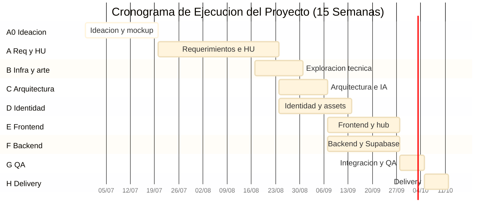

# 1. Plan Detallado del Proyecto: Cronograma y Ruta de Ejecucion (Gantt-in-Markdown)

Este documento define la estructura temporal, las fases y la modalidad de trabajo (sincronica/asincrona) para el desarrollo de la plataforma de gamificacion de analitica de talento humano y coaching corporativo. El plan abarca desde la ideacion inicial hasta el delivery final, optimizado para ejecucion bajo el paradigma de Desarrollo Guiado por Especificaciones (SDD).

## Control de Versiones

| Version | Fecha | Cambio principal | Impacto en cronograma |
| :--- | :--- | :--- | :--- |
| v1.0 | Plan base | Cronograma inicial de 12 semanas, con el primer sprint orientado al levantamiento y refinamiento de historias de usuario. | 12 semanas totales. |
| **v1.1** | **2026-06-29** | **Se agregan 3 semanas iniciales de ideacion para iterar y encontrar la idea ganadora de mayor valor. El primer sprint cambia de rumbo: antes de cerrar requerimientos e historias de usuario, se refinan servicios, experiencias, valor agregado, jugadores y mecanicas para construir un mockup inicial.** | **15 semanas totales. Las fases posteriores se desplazan 3 semanas.** |

**Duracion total del proyecto: 15 semanas** (3 semanas de ideacion inicial + 5 semanas dedicadas al levantamiento exhaustivo de historias de usuario + 7 semanas de diseno, desarrollo e integracion).

## Estructura del Cronograma General (Horizonte: 15 Semanas | Sprint Base: 2 Semanas)

| ID | Fase / Actividad Principal | Duracion | Modalidad | Entregables Clave | Dependencias |
| :--- | :--- | :---: | :---: | :--- | :--- |
| **A0** | **Ideacion Estrategica y Mockup Inicial** | **W1 - W3** | Mixta | Propuesta de valor refinada, definicion inicial de servicios y experiencias, jugadores, mecanicas de gamificacion y mockup navegable inicial. | Ninguna |
| A0.1 | Workshop de reorientacion del primer sprint y criterios de exito | W1 | Sincronica | Acta de cambio de rumbo, hipotesis de valor y criterios para seleccionar la idea ganadora. | - |
| A0.2 | Iteracion de servicios, experiencias, jugadores y mecanicas | W1-W2 | Mixta | Mapa de servicios, experiencia objetivo, perfiles de jugadores y mecanicas candidatas. | A0.1 |
| A0.3 | Construccion y validacion del mockup inicial | W3 | Mixta | Mockup inicial validado como base para requerimientos, historias de usuario y arquitectura. | A0.2 |
| **A** | **Definicion de Requerimientos e Historias de Usuario** | **W4 - W8** | Mixta | Backlog completo refinado en JSON/MD, Historias de Usuario con Criterios de Aceptacion (Gherkin/Given-When-Then). | A0.3 |
| A1 | Workshop de alineacion del Everest Experience a partir del mockup | W4 | Sincronica | Acta de requerimientos funcionales, objetivos psicometricos y alcance validado. | A0.3 |
| A2 | Redaccion exhaustiva de historias tecnicas y de usuario (Admin, Coach, Org, Player) | W5-W8 | Asincrona | Backlog oficial estructurado con tags de epicas y criterios de aceptacion completos. | A1 |
| A3 | Refinamiento y estimacion de Story Points del backlog completo | W8 | Mixta | Backlog priorizado y estimado listo para desarrollo. | A2 |
| **B** | **Exploracion de Infraestructura y Estado del Arte** | **W8 - W9** | Asincrona | Matriz de arquitectura tecnica, benchmark de gamificacion. | A3 |
| B1 | Evaluacion de capacidades y esquemas de Supabase (Auth, RLS, Storage) | W8-W9 | Asincrona | Modelo entidad-relacion preliminar y politicas de seguridad. | A3 |
| B2 | Estado del arte: evaluacion de mecanicas de RPG aplicadas a psicometria | W8-W9 | Asincrona | Documento tecnico de diseno de mecanicas y arboles de decision. | A3 |
| **C** | **Diseno de Arquitectura de Plataforma** | **W9 - W10** | Mixta | Diagramas de componentes, esquema de base de datos y API contracts. | B1, B2 |
| C1 | Diseno del pipeline de datos analiticos para visualizacion de CEOs/Coaches | W9-W10 | Asincrona | Spec de tablas, triggers de Supabase y agregaciones. | B1 |
| C2 | Arquitectura del Agente Coach (Gemini API + guardrails de consulta) | W9-W10 | Sincronica | Definicion del prompt del sistema, vectores y capas de control de privacidad. | B1 |
| **D** | **Identidad Corporativa y Piezas Visuales** | **W9 - W11** | Asincrona | Brandbook, assets del Everest, UI Kit basico. | A0.3, A1 |
| D1 | Creacion de logos, paleta cromatica corporativa y tipografias | W9-W10 | Asincrona | Manual de marca en PDF y SVGs limpios para el frontend. | A1 |
| D2 | Diseno del set de assets: Everest Paths, avatares, medallas y Sherpa NPC | W10-W11 | Asincrona | Spritesheets, ilustraciones de items e interfaz de la montana. | D1 |
| **E** | **Diseno y Desarrollo de Frontend** | **W11 - W13** | Asincrona | Aplicacion SPA web responsiva (HTML5, JS, CSS/Tailwind). | C2, D2 |
| E1 | Implementacion del Login, Hub Central y Gestion de Avatar/Inventario | W11-W12 | Asincrona | Modulos funcionales de cliente con autenticacion acoplada. | C2 |
| E2 | Implementacion de la experiencia Everest (rutas, modales de retos, NPC) | W12-W13 | Asincrona | Motor de renderizado visual del mapa y logicas de decision. | D2, E1 |
| **F** | **Diseno y Desarrollo de Backend (Supabase Edge Functions / DB)** | **W11 - W13** | Asincrona | Base de datos funcional, triggers y capa de guardrails del agente. | C1, C2 |
| F1 | Despliegue del esquema en Supabase + politicas RLS por rol de usuario | W11-W12 | Asincrona | Tablas optimizadas y seguras (Player, Coach, OrgAdmin, SysAdmin). | C1 |
| F2 | Integracion del Agente de IA (Gemini API) con guardrails psicometricos | W12-W13 | Asincrona | Edge Function de Supabase que expone el endpoint seguro de chat. | C2 |
| **G** | **Integracion, Pruebas y Despliegue E2E** | **W14** | Mixta | Plataforma desplegada en entorno de staging/produccion. | E2, F2 |
| G1 | Vinculacion Frontend-Backend y validacion de guardado de estado de ruta | W14 | Asincrona | Pruebas de integracion automatizadas y flujos criticos validados. | E2, F2 |
| G2 | Pruebas funcionales cruzadas (Aceptacion de Usuario / QA de roles) | W14 | Sincronica | QA Report con firmas de conformidad tecnica de los ingenieros. | G1 |
| **H** | **Delivery al Area Funcional y Cierre** | **W15** | Sincronica | Manuales, credenciales maestro, transferencia de conocimiento. | G2 |
| H1 | Entrega de credenciales, despliegue final en produccion y entrenamiento | W15 | Sincronica | Grabacion del workshop de onboarding y entrega del repositorio limpio. | G2 |

---

## Representacion Visual de Linea de Tiempo (Diagrama de Gantt)

```
Semanas:          | W1 | W2 | W3 | W4 | W5 | W6 | W7 | W8 | W9 | W10| W11| W12| W13| W14| W15|
------------------------------------------------------------------------------------------------
Fase A0: Ideacion |XXXX|XXXX|XXXX|    |    |    |    |    |    |    |    |    |    |    |    |
Fase A: Req & HU  |    |    |    |XXXX|XXXX|XXXX|XXXX|XXXX|    |    |    |    |    |    |    |
Fase B: Infra/Art |    |    |    |    |    |    |    |XXXX|XXXX|    |    |    |    |    |    |
Fase C: Arq & IA  |    |    |    |    |    |    |    |    |XXXX|XXXX|    |    |    |    |    |
Fase D: UI/UX & Id|    |    |    |    |    |    |    |    |XXXX|XXXX|XXXX|    |    |    |    |
Fase E: Dev Front |    |    |    |    |    |    |    |    |    |    |XXXX|XXXX|XXXX|    |    |
Fase F: Dev Back  |    |    |    |    |    |    |    |    |    |    |XXXX|XXXX|XXXX|    |    |
Fase G: Integra/QA|    |    |    |    |    |    |    |    |    |    |    |    |    |XXXX|    |
Fase H: Delivery  |    |    |    |    |    |    |    |    |    |    |    |    |    |    |XXXX|
```


```mermaid
%%{init: {"theme": "base", "gantt": {"displayMode": "compact", "barHeight": 24, "barGap": 6, "topPadding": 36, "leftPadding": 135, "gridLineStartPadding": 18, "fontSize": 12, "sectionFontSize": 12}}}%%
gantt
    title Cronograma de Ejecucion del Proyecto (15 Semanas)
    dateFormat  YYYY-MM-DD
    axisFormat  %d/%m

    section A0 Ideacion
    Ideacion y mockup :active, a0, 2026-06-29, 21d

    section A Req y HU
    Requerimientos e HU :a1, 2026-07-20, 35d

    section B Infra y arte
    Exploracion tecnica :b1, 2026-08-17, 14d

    section C Arquitectura
    Arquitectura e IA :c1, 2026-08-24, 14d

    section D Identidad
    Identidad y assets :d1, 2026-08-24, 21d

    section E Frontend
    Frontend y hub :e1, 2026-09-07, 21d

    section F Backend
    Backend y Supabase :f1, 2026-09-07, 21d

    section G QA
    Integracion y QA :g1, 2026-09-28, 7d

    section H Delivery
    Delivery :h1, 2026-10-05, 7d
```

## Criterios de Transicion entre Fases (Milestones)

1. **M0 (Fin de Semana 3):** Idea ganadora seleccionada, propuesta de valor refinada y mockup inicial validado como base para requerimientos.
2. **M1 (Fin de Semana 8):** Backlog completo firmado por Oscar (PO), todas las HU refinadas con criterios de aceptacion y estimadas por el equipo tecnico.
3. **M2 (Fin de Semana 10):** Esquema de base de datos disenado, arquitectura de backend definida e interfaz UI del Everest lista para codificacion.
4. **M3 (Fin de Semana 13):** Codigo congelado (Code Freeze) con frontend y backend integrados, cobertura basica de pruebas unitarias.
5. **M4 (Fin de Semana 15):** Entrega formal del software en produccion y firma de acta de conformidad del delivery.
